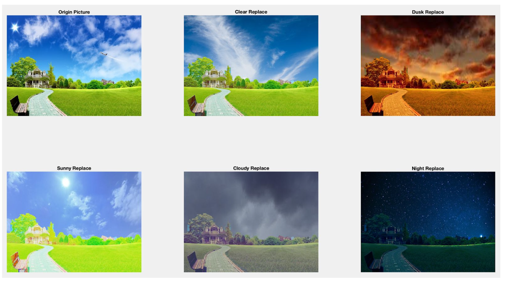

# Sky-Replacement

NTHU CS. 10910 CS452000 Introduction to Image Processing. Final Project.

Movtivated by paper "Sky is Not the Limit: Semantic-Aware Sky Replacement".  
Our group wants to reproduce the result using traditional math formulas instead of A.I. or Machine Learning(ML) techniques.

## Project structure
1. Sky segmentation
2. Retrieve sky images
3. Realistic sky style transfer
4. Sky replacement
5. Boundary smoothing  

## Results

